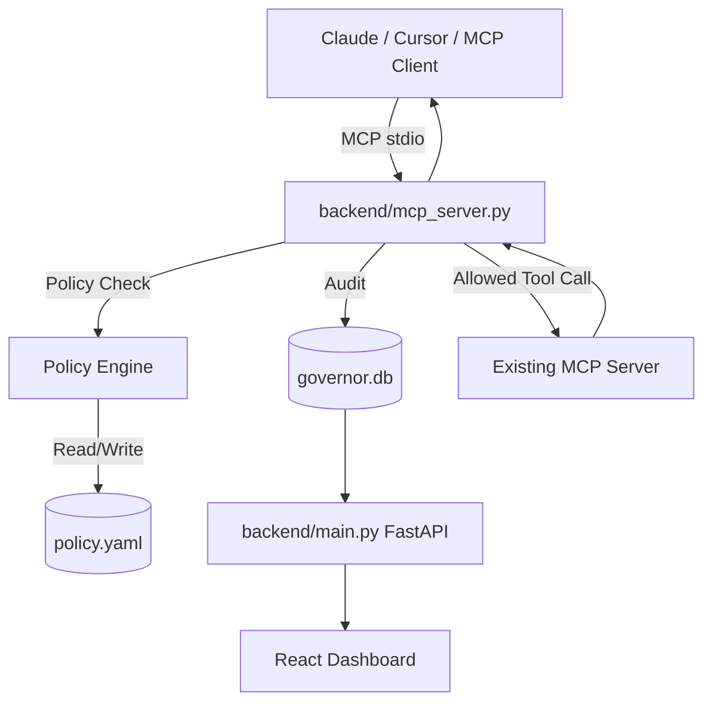

<p align="center">
  
</p>

# Armadillo Governor MCP Wrapper

Governance wrapper for Model Context Protocol (MCP) tool execution.

This project now has two clear paths:

- `run_mcp.sh`: production entrypoint for the governance control plane (API + dashboard process management).
- `backend/mcp_server.py`: production MCP wrapper binary that sits in front of an existing upstream MCP server and enforces policy before forwarding tool calls.
- `run.sh`: hackathon simulation script (left intact).

## What This Is

A policy-enforcing MCP proxy that:

1. connects to an upstream MCP server,
2. mirrors upstream tools to the client,
3. evaluates each tool call against local policy,
4. blocks/reviews/allows calls,
5. forwards allowed calls upstream,
6. records decisions in the governance audit DB.

## Production Architecture



## Enterprise Readiness Assessment

### Implemented in this repo now

- Real upstream MCP proxy behavior in `backend/mcp_server.py` (no longer only mock local tools).
- Default-deny IAM-style policy evaluation (`ALLOW`/`DENY`/`REVIEW`).
- Human-in-the-loop workflow for `REVIEW` decisions with timeout.
- Audit logging with execution lifecycle states (`PENDING`, `APPROVED`, `COMPLETED`, `FAILED`, etc.).
- Safer `run_mcp.sh` process lifecycle: `start|stop|restart|status|logs`, PID files, health checks, no blind `kill -9` on ports.
- Configurable CORS and optional admin API key for mutating governance endpoints.

### Still recommended before regulated enterprise rollout

- External DB (Postgres/MySQL) and migrations instead of SQLite for HA and durability requirements.
- Strong identity propagation from client to wrapper (today agent identity is provided via configured default or special tool arg).
- AuthN/AuthZ in front of dashboard/API (OIDC, mTLS, reverse proxy, WAF).
- Policy change controls (versioning, approvals, immutable audit stream, rollback workflow).
- Centralized observability (metrics, tracing, SIEM export).

## Installation

1. Clone and enter repository.

```bash
git clone <repo-url>
cd armadillo-mcp-wrapper
```

2. Install Python dependencies.

```bash
python -m venv .venv
source .venv/bin/activate
pip install -r requirements.txt
```

3. Install frontend dependencies.

```bash
cd frontend-react
npm install
cd ..
```

## Run Governance Control Plane (`run_mcp.sh`)

`run_mcp.sh` manages backend API and dashboard UI process lifecycle.

```bash
./run_mcp.sh start
./run_mcp.sh status
./run_mcp.sh logs backend
./run_mcp.sh stop
```

Default behavior:

- Backend: `http://127.0.0.1:8000`
- UI (preview mode): `http://127.0.0.1:5173`

Useful environment variables:

- `GOVERNOR_BACKEND_PORT` (default `8000`)
- `GOVERNOR_BACKEND_WORKERS` (default `1`)
- `GOVERNOR_UI_MODE` (`preview|dev|none`, default `preview`)
- `GOVERNOR_UI_PORT` (default `5173`)
- `GOVERNOR_ADMIN_API_KEY` (optional; secures write endpoints)
- `GOVERNOR_CORS_ORIGINS` (comma-separated origins)

## Run Wrapper in MCP Clients (`backend/mcp_server.py`)

### Required wrapper configuration

The wrapper must know how to start upstream MCP:

- `UPSTREAM_MCP_COMMAND`
- optional `UPSTREAM_MCP_ARGS` (JSON list or shell-style string)
- optional `UPSTREAM_MCP_CWD`
- optional `UPSTREAM_MCP_ENV_JSON` (JSON object)

### Claude Desktop example

```json
{
  "mcpServers": {
    "governor-wrapper": {
      "command": "python",
      "args": [
        "/absolute/path/armadillo-mcp-wrapper/backend/mcp_server.py"
      ],
      "env": {
        "UPSTREAM_MCP_COMMAND": "npx",
        "UPSTREAM_MCP_ARGS": "[\"-y\",\"@modelcontextprotocol/server-filesystem\",\"/Users/you\"]",
        "GOVERNOR_POLICY_PATH": "/absolute/path/armadillo-mcp-wrapper/policy.yaml",
        "GOVERNOR_AGENT_ID": "claude-desktop"
      }
    }
  }
}
```

### Cursor example

Command:

```bash
python /absolute/path/armadillo-mcp-wrapper/backend/mcp_server.py
```

Environment:

- `UPSTREAM_MCP_COMMAND=npx`
- `UPSTREAM_MCP_ARGS=["-y","@modelcontextprotocol/server-filesystem","/Users/you"]`
- `GOVERNOR_POLICY_PATH=/absolute/path/armadillo-mcp-wrapper/policy.yaml`
- `GOVERNOR_AGENT_ID=cursor`

## Policy Model (`policy.yaml`)

The wrapper supports:

- IAM-style `access_control` schema (preferred)
- legacy `rules` schema (auto-converted)

Decision precedence:

1. `DENY` wins
2. then `REVIEW`
3. then `ALLOW`
4. otherwise default deny

## Agent Identity

For now, agent identity is sourced from:

1. tool argument `__governor_agent_id` (if provided), else
2. `GOVERNOR_AGENT_ID` env var, else
3. `Unknown`

Example tool argument override:

```json
{
  "query": "SELECT 1",
  "__governor_agent_id": "payments-prod-agent"
}
```

## Dashboard / API Endpoints

- `GET /healthz`
- `GET /readyz`
- `GET /api/requests`
- `GET /api/stats`
- `GET /api/access-control`
- `POST /api/access-control/policies`
- `DELETE /api/access-control/policies/{policy_id}`
- `POST /api/access-control/statements`
- `DELETE /api/access-control/policies/{policy_id}/statements/{statement_id}`
- `POST /api/access-control/agents/attach-policy`
- `POST /api/access-control/agents/detach-policy`
- `POST /api/access-control/agents/remove`
- `POST /api/approve/{request_id}`
- `POST /api/deny/{request_id}`
- `POST /api/reset`

If `GOVERNOR_ADMIN_API_KEY` is set, write endpoints require header `X-API-Key`.

## Universal Wrapper Status (Implemented)

The universal governance wrapper is now implemented in this repository.

- Production wrapper binary: `backend/mcp_server.py`
- Production control-plane launcher: `run_mcp.sh`

This means the project already supports the intended flow of wrapping an existing MCP server, enforcing policy, and forwarding approved calls.

## Hackathon Simulation Path (Unchanged)

Hackathon/demo flow remains available and separate:

```bash
./run.sh
```

`run.sh` and simulation files are intentionally preserved as a demo path and are not required for production wrapper usage.
