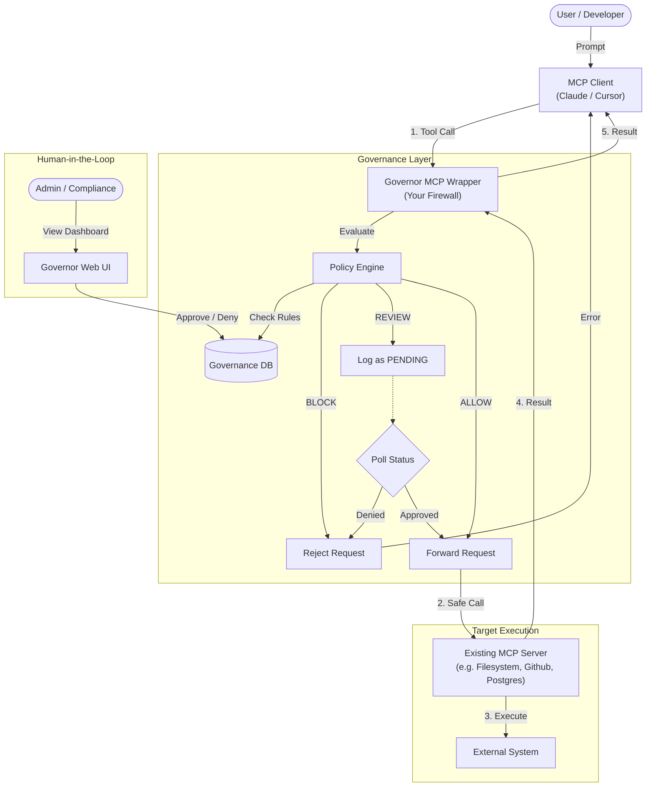

<p align="center">
  
</p>


This repository contains a governance-focused **Model Context Protocol (MCP)** server. It acts as a middleware that intercepts tool calls from LLMs and enforces policies (Allow, Block, or Human-in-the-Loop Review) before execution.

## 🚀 Features

- **Real MCP Server**: Compatible with Claude Desktop, Cursor, and other MCP clients.
- **Policy Engine**: Evaluates every tool call against a set of rules.
  - ✅ **ALLOW**: Safe tools (e.g., `read_file` on user dirs, `get_weather`) run immediately.
  - 🛑 **BLOCK**: Dangerous tools (e.g., reading `/etc/shadow`) are rejected.
  - ✋ **REVIEW**: Sensitive actions (e.g., `delete_database`, `deploy_contract`) must be approved by a human administrator via the Web UI.
- **Simulation Mode**: A built-in traffic generator and web dashboard to demonstrate the governance flow.

## 🏗️ Architecture



## 📦 Installation

1. **Clone the repository**:

    ```bash
    git clone <repository-url>
    cd governor-mcp
    ```

2. **Create and activate a virtual environment** (recommended):

    ```bash
    python -m venv venv
    source venv/bin/activate  # On Windows: venv\Scripts\activate
    ```

3. **Install dependencies**:

    ```bash
    pip install -r requirements.txt
    ```

## 🔌 Connecting to an MCP Client

You can connect this server to any MCP-compliant client.

### Claude Desktop Configuration

Add the following to your `claude_desktop_config.json`:

```json
{
  "mcpServers": {
    "governor": {
      "command": "python",
      "args": ["/absolute/path/to/governor-mcp/backend/mcp_server.py"]
    }
  }
}
```

**Note**: Replace `/absolute/path/to/...` with the full path to this repository on your machine.

### Cursor Configuration

1. Go to **Cursor Settings** > **MCP**.
2. Click **Add New MCP Server**.
3. **Name**: `governor`
4. **Type**: `stdio`
5. **Command**: `python /absolute/path/to/governor-mcp/backend/mcp_server.py`

### Running Dashboard + Real MCP

To run the Dashboard (so you can approve requests) while using your own MCP Client:

1. **Run the script**:

    ```bash
    ./run_mcp.sh
    ```

    This starts the Backend API and Frontend, but **NOT** the simulation agent.

2. **Connect your Client**:
    Configure Claude/Cursor to use `backend/mcp_server.py`.

3. **View Dashboard**:
    Open [http://localhost:5173](http://localhost:5173).


## 🛠️ Available Tools

The server exposes the following tools for testing:

| Tool | Policy | Description |
| :--- | :--- | :--- |
| `read_file` | **ALLOW** / **BLOCK** | Reads a file. Blocked for system paths (e.g., `/etc/shadow`, `.env`). |
| `get_weather` | **ALLOW** | Returns mock weather data. |
| `network_scan` | **ALLOW** / **BLOCK** | Scans a target. Blocked for internal servers. |
| `delete_database` | **REVIEW** | Requires human approval. (Mock action) |
| `deploy_contract` | **REVIEW** | Requires human approval. (Mock action) |
| `grant_access` | **REVIEW** | Requires human approval. (Mock action) |
| `access_aws_keys` | **REVIEW** | Requires human approval. (Mock action) |

## 🌟 Envisioned Future Work: The Universal Governor Wrapper

The architecture diagram above reflects our long-term vision: **Governor as a Universal Middleware**.

Currently, the Governor MCP server has its own built-in tools. In the future, we envision the Governor acting as a **transparent wrapper** (or proxy) around *any* existing MCP server (e.g., a Filesystem MCP, a GitHub MCP, or a Postgres MCP).

### How it will work

1. **Wrap**: You start the Governor and point it to a target MCP server (e.g., `npx -y @modelcontextprotocol/server-filesystem`).
2. **Intercept**: The Governor intercepts all tool calls destined for the target.
3. **Govern**: It applies your centralized policy rules (Allow/Block/Review).
4. **Forward**: If allowed/approved, it forwards the call to the target server and returns the result to the client.

This transforms the Governor into a **Firewall for LLM Tools**, allowing you to "harden" any MCP server without modifying its code.
